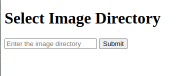
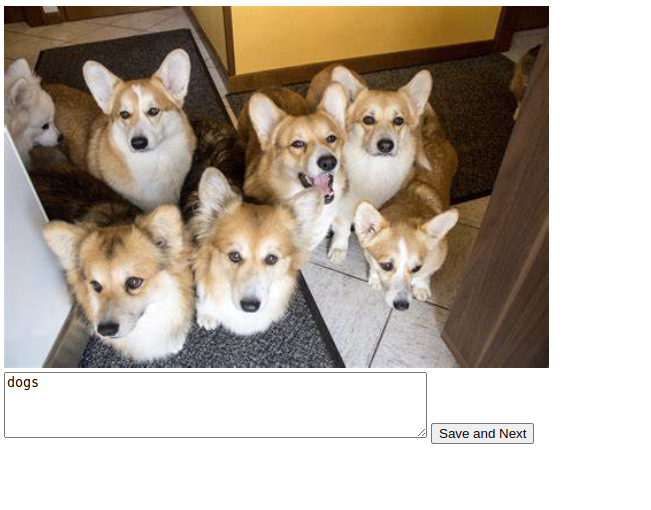

# Image Viewer and Description Writer



This is a web-based image viewer and description writer application built using Flask. It allows the user to select a directory containing images, navigate through those images, and write descriptions for them. The descriptions are saved as text files.

## Overview

This program provides a user-friendly solution for professionals working in the AI industry to efficiently manage image-related tasks for their Fiverr gig. It presents an easy-to-use locally hosted web application that enables users to attach prompts or descriptions to images seamlessly.



## Requirements

- Python 3.6 or higher
- Flask package

To install the required Flask package, run the following command:

```
pip install flask
```

## How to use

1. Run the Flask application using the following command:

```
python app.py
```

2. Open your web browser and visit: http://localhost:8881

3. Enter the path of the folder containing your images and click "Submit".

4. The first image in the folder will be displayed along with a form field to enter the description. Add a description and click "Save and Next".

5. The application will save the description as a text file with the same name as the image, and display the next image in the folder.

6. Continue adding descriptions to the images. Once all images have a description, the application will cycle back to display the first image again.

The solution is designed to be functional for any directory, not just a specific working directory. This allows users the flexibility to work with different directories and manage their images effectively.

By using this program, you can streamline your Fiverr gig workflow, improve efficiency, and enhance your productivity in a professional and user-friendly manner.

## Customization

You may modify the templates and styles directly in the Python code. Look for `DIRECTORY_FORM_HTML` and `IMAGE_VIEW_HTML` variables in the code to edit the templates.